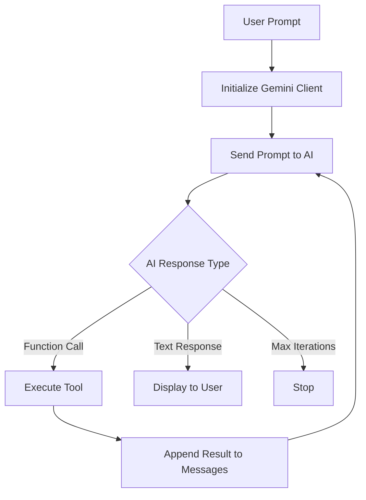

# 🤖 AI Coding Agent - Debugger Agent

A powerful AI-powered coding assistant built with Google's Gemini 2.5 Flash model that can autonomously interact with your codebase through function calling. This agent can read, write, execute Python files, and navigate directory structures within a sandboxed working directory.

## 📋 Table of Contents

- [Overview](#overview)
- [Features](#features)
- [Architecture](#architecture)
- [Setup Instructions](#setup-instructions)
- [Usage](#usage)
- [Available Tools](#available-tools)
- [How It Works](#how-it-works)
- [Configuration](#configuration)
- [Examples](#examples)
- [Security](#security)
- [Troubleshooting](#troubleshooting)
- [License](#license)

---

## 🎯 Overview

The **Debugger Agent** is an AI coding assistant that leverages Google's Gemini API to provide intelligent code analysis, debugging, and file manipulation capabilities. It operates within a constrained working directory (default: `calculator`) to ensure safe execution and prevent unauthorized file system access.

### Key Capabilities

- 📂 **File System Navigation**: List and explore directory structures
- 📖 **Code Reading**: Read and analyze file contents
- ✍️ **Code Writing**: Create and modify files with intelligent suggestions
- ▶️ **Code Execution**: Run Python files with custom arguments
- 🔒 **Sandboxed Environment**: All operations are restricted to the working directory
- 🧠 **Intelligent Planning**: Uses AI to create multi-step execution plans

---

## ✨ Features

### 🔧 Core Functionality

1. **Autonomous Code Analysis**: Understands project structure and dependencies
2. **Test-Driven Workflow**: Automatically identifies and runs tests to verify behavior
3. **Iterative Problem Solving**: Can perform up to 20 iterations to solve complex tasks
4. **Verbose Mode**: Optional detailed logging of function calls and token usage
5. **Error Handling**: Robust error handling with informative messages

### 🛡️ Safety Features

- **Working Directory Constraint**: All file operations are restricted to a specified directory
- **Path Validation**: Prevents directory traversal attacks
- **Timeout Protection**: Python execution limited to 30 seconds
- **Character Limits**: File reading capped at 10,000 characters to prevent memory issues

---

## 🏗️ Architecture

```
workflow3/
├── main.py                 # Entry point and orchestration logic
├── call_function.py        # Function dispatcher
├── config.py              # Configuration constants
├── requirements.txt       # Python dependencies
├── .env                   # Environment variables (API keys)
├── functions/             # Tool implementations
│   ├── get_files_info.py     # Directory listing
│   ├── get_file_content.py   # File reading
│   ├── write_file.py         # File writing
│   └── run_python_file.py    # Python execution
└── calculator/            # Default working directory (example project)
    ├── main.py
    ├── test.py
    └── pkg/
```

### Component Overview

| Component | Purpose |
|-----------|---------|
| `main.py` | Orchestrates the AI agent loop, manages conversation history |
| `call_function.py` | Routes function calls to appropriate tool implementations |
| `functions/` | Contains all tool implementations with schemas |
| `config.py` | Stores configuration constants (e.g., MAX_CHARS) |
| `calculator/` | Example working directory for the agent |

---

## 🚀 Setup Instructions

### Prerequisites

- **Python**: 3.8 or higher
- **Google Gemini API Key**: Get one from [Google AI Studio](https://makersuite.google.com/app/apikey)
- **Git**: For cloning the repository (optional)

### Installation Steps

1. **Clone or Download the Repository**
   ```bash
   cd c:\Users\andys\Desktop\AI_agent_boxe\workflow3
   ```

2. **Create a Virtual Environment** (Recommended)
   ```bash
   python -m venv .venv
   ```

3. **Activate the Virtual Environment**
   - Windows:
     ```bash
     .venv\Scripts\activate
     ```
   - Linux/Mac:
     ```bash
     source .venv/bin/activate
     ```

4. **Install Dependencies**
   ```bash
   pip install -r requirements.txt
   ```
   
   **Core Dependencies:**
   - `google-genai`: Google's Gemini API client
   - `python-dotenv`: Environment variable management
   - Additional ML/data science libraries (see `requirements.txt`)

5. **Configure Environment Variables**
   
   Create a `.env` file in the project root:
   ```env
   Gemini_API_KEY=your_api_key_here
   ```

6. **Verify Installation**
   ```bash
   python main.py "List the files in the working directory"
   ```

---

## 💻 Usage

### Basic Command Structure

```bash
python main.py "<your_prompt>" [--verbose]
```

### Command-Line Arguments

| Argument | Required | Description |
|----------|----------|-------------|
| `<prompt>` | ✅ Yes | Natural language instruction for the agent |
| `--verbose` | ❌ No | Enable detailed logging (function calls, token usage) |

### Example Commands

```bash
# List files in the working directory
python main.py "What files are in this project?"

# Read and analyze code
python main.py "Show me the content of main.py"

# Run tests
python main.py "Run the test file and show me the results"

# Debug and fix issues
python main.py "The tests are failing. Find the bug and fix it."

# Create new files
python main.py "Create a new function to calculate factorial in pkg/math_utils.py"

# Verbose mode for debugging
python main.py "Analyze the project structure" --verbose
```

---

## 🛠️ Available Tools

The agent has access to four primary tools:

### 1. 📂 `get_files_info`

**Purpose**: List files and directories with metadata

**Parameters:**
- `directory` (optional): Relative path from working directory (default: ".")

**Returns:**
```
Name: main.py | Type: File | Size: 757 bytes
Name: test.py | Type: File | Size: 1390 bytes
Name: pkg | Type: Directory | Size: 128 bytes
```

**Example Usage:**
```python
# Agent internally calls:
get_files_info(directory="pkg")
```

---

### 2. 📖 `get_file_content`

**Purpose**: Read file contents as a string

**Parameters:**
- `file_path` (required): Relative path to the file

**Returns:**
- File content (up to 10,000 characters)
- Truncation notice if file exceeds limit

**Example Usage:**
```python
# Agent internally calls:
get_file_content(file_path="main.py")
```

**Limitations:**
- Maximum 10,000 characters (configurable in `config.py`)
- UTF-8 encoding only

---

### 3. ✍️ `write_file`

**Purpose**: Create or overwrite files

**Parameters:**
- `file_path` (required): Relative path to the file
- `content` (required): String content to write

**Returns:**
```
Success: Content written to "pkg/utils.py" (245 characters)
```

**Features:**
- Automatically creates parent directories
- Overwrites existing files
- UTF-8 encoding

**Example Usage:**
```python
# Agent internally calls:
write_file(
    file_path="pkg/utils.py",
    content="def add(a, b):\n    return a + b"
)
```

---

### 4. ▶️ `run_python_file`

**Purpose**: Execute Python files with optional arguments

**Parameters:**
- `file_path` (required): Relative path to the Python file
- `args` (optional): Array of command-line arguments

**Returns:**
```
--- Output of "test.py" ---

STDOUT:
All tests passed!

STDERR:

------------------------------
```

**Features:**
- 30-second timeout protection
- Captures both stdout and stderr
- Returns exit code on errors

**Example Usage:**
```python
# Agent internally calls:
run_python_file(
    file_path="test.py",
    args=["--verbose"]
)
```

---

## 🧠 How It Works

### Agent Loop Architecture



### Execution Flow

1. **Initialization**
   - Load API key from `.env`
   - Initialize Gemini client with `gemini-2.5-flash` model
   - Set up system prompt with tool descriptions

2. **Conversation Loop** (Max 20 iterations)
   - Send user prompt + conversation history to AI
   - AI responds with either:
     - **Function call**: Execute tool and append result
     - **Text response**: Display to user and exit

3. **Function Execution**
   - Validate parameters
   - Check working directory constraints
   - Execute tool operation
   - Return structured result

4. **Safety Checks**
   - All file paths validated against working directory
   - Prevents directory traversal (`../` attacks)
   - Timeout protection for code execution

### System Prompt

The agent is instructed with the following capabilities:

```
You are a helpful AI coding agent.

When a user asks a question or makes a request, make a function call plan. You can perform the following operations:

- List files and directories
- Write to a file (create or update)
- Read the content of a file
- Run a Python file with optional arguments

When the user asking about code project they are referring to the working directory.
So check the project files and figuring out how to run the project and how to run the tests, 
you'll always want to test the tests and the actual project to verify that behavior is working

All paths you provide should be relative to the working directory.
You do not need to specify the working directory in your function calls as it is automatically 
injected for security reasons.
```

---

## ⚙️ Configuration

### Environment Variables

Create a `.env` file:

```env
# Required
Gemini_API_KEY=your_gemini_api_key_here
```

### Configuration Constants (`config.py`)

```python
MAX_CHARS = 10000  # Maximum characters to read from a file
```

### Working Directory

The default working directory is set in `call_function.py`:

```python
working_directory = "calculator"
```

**To change the working directory:**
1. Edit `call_function.py`
2. Update the `working_directory` variable
3. Ensure the directory exists

---

## 📚 Examples

### Example 1: Analyze Project Structure

```bash
python main.py "What is the structure of this project?"
```

**Agent Actions:**
1. Calls `get_files_info(directory=".")`
2. Analyzes directory structure
3. Provides summary of project organization

---

### Example 2: Debug Failing Tests

```bash
python main.py "The tests are failing. Find and fix the bug."
```

**Agent Actions:**
1. Calls `get_files_info()` to find test files
2. Calls `run_python_file(file_path="test.py")` to see failures
3. Calls `get_file_content(file_path="main.py")` to analyze code
4. Identifies bug
5. Calls `write_file()` to fix the issue
6. Calls `run_python_file()` again to verify fix

---

### Example 3: Create New Feature

```bash
python main.py "Add a subtract function to the calculator and write tests for it"
```

**Agent Actions:**
1. Reads existing code structure
2. Writes new function to appropriate file
3. Updates test file with new test cases
4. Runs tests to verify implementation

---

### Example 4: Verbose Mode

```bash
python main.py "List all Python files" --verbose
```

**Output:**
```
Usage Metadata:

user prompt: List all Python files
prompt tokens used: 1234
response tokens used: 567

Function Calls:
get_files_info({'directory': '.'})

Calling function :
get_files_info

[Results displayed...]
```

---

## 🔒 Security

### Sandboxing

All file operations are constrained to the working directory through:

1. **Absolute Path Validation**
   ```python
   abs_working_dir = os.path.abspath(working_directory)
   abs_file_path = os.path.abspath(os.path.join(working_directory, file_path))
   
   if not abs_file_path.startswith(abs_working_dir):
       return "Error: Cannot access file outside working directory"
   ```

2. **Directory Traversal Prevention**
   - Blocks `../` path manipulation
   - Validates all paths before operations

### Execution Limits

- **Timeout**: Python execution limited to 30 seconds
- **Character Limit**: File reading capped at 10,000 characters
- **Iteration Limit**: Maximum 20 AI iterations per request

### Best Practices

- ✅ Keep sensitive data outside the working directory
- ✅ Store API keys in `.env` (gitignored)
- ✅ Review agent actions in verbose mode for critical operations
- ✅ Use version control to track agent modifications

---

## 🐛 Troubleshooting

### Common Issues

#### 1. "Please provide a prompt as a command-line argument"

**Cause**: No prompt provided

**Solution**:
```bash
python main.py "Your prompt here"
```

---

#### 2. "response is malformed"

**Cause**: API connection issues or invalid response

**Solutions**:
- Check internet connection
- Verify API key in `.env`
- Check Gemini API status

---

#### 3. "Error: Cannot read/write file outside working directory"

**Cause**: Attempting to access files outside the working directory

**Solution**: Ensure all file paths are relative to the working directory

---

#### 4. Module Import Errors

**Cause**: Missing dependencies

**Solution**:
```bash
pip install -r requirements.txt
```

---

#### 5. File Truncation Warning

**Cause**: File exceeds 10,000 character limit

**Solution**: Increase `MAX_CHARS` in `config.py` or split large files

---

### Debug Mode

Enable verbose mode to see detailed execution:

```bash
python main.py "Your prompt" --verbose
```

This shows:
- Function calls with arguments
- Token usage statistics
- Detailed execution flow

---

## 📊 Token Usage

The agent uses the `gemini-2.5-flash` model with the following characteristics:

- **Context Window**: Large context for complex tasks
- **Function Calling**: Native support for tool use
- **Cost-Effective**: Flash variant optimized for speed and cost

**Monitor Usage** (with `--verbose`):
```
prompt tokens used: 1234
response tokens used: 567
```

---

## 🔄 Workflow Integration

This agent can be integrated into larger workflows:

1. **CI/CD Pipelines**: Automated code review and testing
2. **Development Workflow**: Quick debugging and code generation
3. **Documentation**: Automated README and docstring generation
4. **Refactoring**: Intelligent code restructuring

---

## 🤝 Contributing

To extend the agent with new tools:

1. **Create Tool Implementation** in `functions/`
   ```python
   # functions/my_tool.py
   from google.genai import types
   
   def my_tool(working_directory, param1):
       # Implementation
       return result
   
   schema_my_tool = types.FunctionDeclaration(
       name="my_tool",
       description="Tool description",
       parameters=types.Schema(...)
   )
   ```

2. **Register in `main.py`**
   ```python
   from functions.my_tool import schema_my_tool
   
   available_functions = types.Tool(
       function_declarations=[
           # ... existing tools
           schema_my_tool
       ]
   )
   ```

3. **Add Dispatcher in `call_function.py`**
   ```python
   if function_call_part.name == "my_tool":
       result = my_tool(working_directory, **function_call_part.args)
   ```

---

## 🙏 Acknowledgments

- **Google Gemini**: Powered by Google's Gemini 2.5 Flash model
- **Python Community**: Built with open-source Python libraries

---

## 📞 Support

For issues or questions:
1. Check the [Troubleshooting](#troubleshooting) section
2. Review verbose output for debugging
3. Verify API key and dependencies

---

**Happy Coding! 🚀**

---
Contributor : Andy & Marc-Yvan

